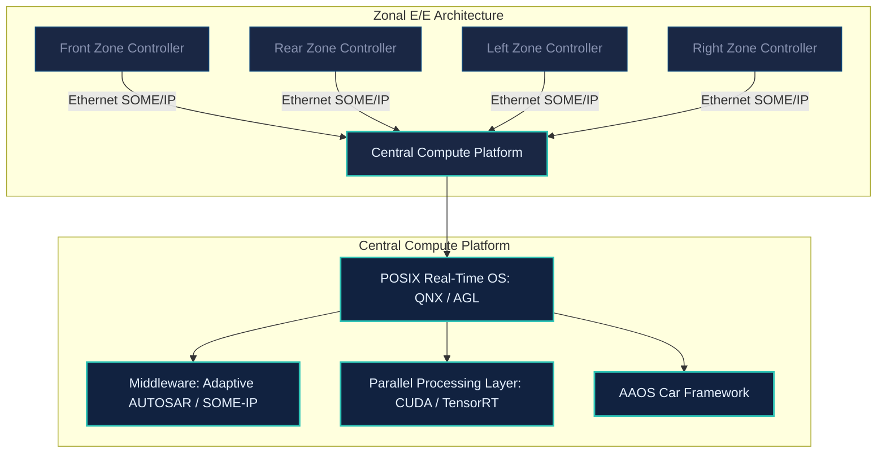
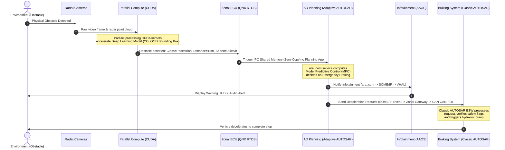

# Software-Defined & AI-Defined Vehicles: The Next Generation Automotive Architecture
*A Technical Whitepaper and Developer Skill Matrix by Robotics Corner*

---

## 1. Introduction: The Automotive Architectural Paradigm Shift

The automotive industry is undergoing its most significant revolution since the invention of the assembly line. Traditional vehicles rely on **decentralized, hardware-defined Electrical/Electronic (E/E) architectures**, where 100+ isolated Electronic Control Units (ECUs) are connected via low-bandwidth networks (CAN/LIN). Each ECU runs static, single-purpose software tightly coupled to specific hardware.

To enable features like autonomous driving, intelligent cabins, and over-the-air (OTA) updates, next-generation vehicles are transitioning to **Software-Defined Vehicles (SDV)** and **AI-Defined Vehicles (AIDV)**.

### 1.1 Software-Defined Vehicles (SDV)
An SDV decouples hardware from software. Through virtualization, middleware abstractions, and centralized high-performance computing (HPC), software can be developed, tested, and updated independently of the physical vehicle platform. This brings the agility of cloud computing and continuous deployment to safety-critical automotive systems.

### 1.2 AI-Defined Vehicles (AIDV)
While SDVs provide the infrastructure to run and update code, **AIDVs represent the intelligence layer**. AIDVs place Artificial Intelligence at the center of the vehicle's decision-making and user experience:
* **Perception & Localization**: Multi-camera, LiDAR, and radar sensor fusion running deep convolutional networks (CNNs) and transformer models.
* **Intelligent Cabins**: Large Language Models (LLMs) and Natural Language Processing (NLP) running locally or hybrid-cloud to enable natural in-cabin assistant conversations, gesture detection, and driver monitoring.
* **Control Systems**: Reinforcement learning and model predictive control (MPC) handling complex path planning and vehicle dynamics in real-time.

---

## 2. Deep Technical Breakdown of Key Domains

### 2.1 Adaptive AUTOSAR
Unlike Classic AUTOSAR (designed for deeply embedded, hard real-time, resource-constrained ECUs running on OSEK/VDX), **Adaptive AUTOSAR** targets high-performance computing platforms running POSIX operating systems.
* **Service-Oriented Architecture (SOA)**: Applications (Adaptive Applications - AAs) do not communicate via static signals; instead, they expose and consume services dynamically.
* **ara Runtime**: Developers interact with the platform through standardized C++ APIs (e.g., `ara::com` for communication, `ara::exec` for execution management, `ara::phm` for platform health management, and `ara::diag` for diagnostics).
* **Manifests**: XML/ARXML-based configuration files define machine properties, execution contexts, and service deployment parameters, permitting runtime binding.

### 2.2 IPC & SOME/IP
In an SDV, communication occurs both inside a single SoC (Inter-Process Communication - IPC) and across physical controllers (network communication).
* **SOME/IP (Scalable service-Oriented MiddlewarE over IP)**: An automotive-specific protocol designed for high-bandwidth Ethernet networks. It supports remote procedure calls (RPC), event subscription/notification, and dynamic service discovery (SOME/IP-SD).
* **IPC**: For high-bandwidth, low-latency communications on a single SoC (e.g., streaming camera data from a hypervisor partition to an ADAS partition), POSIX-compliant shared memory (`shm_open`, `mmap`), message queues, and zero-copy IPC mechanisms are utilized.

### 2.3 Diagnostics & DoIP
Diagnostics ensure that vehicle faults are recorded, reported, and can be resolved during servicing or via OTA updates.
* **DoIP (Diagnostic Communication over IP)**: ISO 13400 standardizes diagnostics over Ethernet, allowing high-speed flashing and diagnostics compared to legacy CAN-based UDS.
* **UDS (Unified Diagnostic Services - ISO 14229)**: The core protocol defining service requests (e.g., reading/clearing Diagnostic Trouble Codes - DTCs, control of routines, security access).
* **Tools**: Vector CANoe/CANalyzer, ODX/PDX database generators, and diagnostic stack implementation.

### 2.4 POSIX-Based OSes (AGL & QNX)
Next-generation centralized compute platforms rely on commercial or open-source RTOS and OS platforms.
* **QNX Neutrino RTOS**: A microkernel-based commercial operating system certified to ISO 26262 ASIL-D. Features strict memory protection, deterministic scheduling, and high availability.
* **Automotive Grade Linux (AGL)**: A collaborative open-source project building a Linux-based platform for infotainment (IVI), instrument clusters, and telematics.
* **Hypervisors**: Enable running safety-critical partitions (QNX for ADAS/control) side-by-side with non-critical partitions (Android Automotive for IVI) on the same silicon.

### 2.5 Modern C++ & Embedded C/RTOS
* **Modern C++ (C++14/17/20/23)**: The primary programming language for Adaptive AUTOSAR and high-performance algorithms. Utilizes smart pointers for resource management (`std::unique_ptr`, `std::shared_ptr`), type-safe templates, standard library algorithms, and standard threading utilities.
* **Embedded C & RTOS**: Used in microcontrollers handling low-level actuation and sensor interfacing (e.g., Classic AUTOSAR, FreeRTOS, SafeRTOS). Focuses on bare-metal programming, register configuration, interrupt service routines (ISRs), and resource optimization.

### 2.6 Software Architecture & Design
* **Design Patterns**: Applying creational, structural, and behavioral patterns in a resource-constrained environment (e.g., lock-free queues, observer patterns, active object pattern).
* **Architectural Styles**: Designing layered, service-oriented, microservices, and zonal architectures.
* **Functional Safety (ISO 26262)**: Designing system safety concepts, software-level safety requirements (ASIL mapping), freedom from interference (FFI), and memory partitioning.

### 2.7 Algorithms & Parallel Processing (CUDA)
* **Autonomous Driving Algorithms**: Perception (sensor fusion, Kalman filtering), planning (A*, Hybrid A*, Model Predictive Control), and state estimation.
* **Parallel Processing (CUDA)**: Accelerating deep learning and computer vision tasks by writing custom kernels for mass parallelism on NVIDIA GPUs. Managing memory allocation (pinned memory, unified memory), streams, and execution configurations.

### 2.8 Build Systems (Bazel)
In large automotive projects with thousands of dependencies (C++, Python, CUDA, external libraries), traditional build systems (Make, CMake) scale poorly.
* **Bazel**: A fast, hermetic, and reproducible build system designed by Google. Bazel tracks exact file inputs and outputs to cache build steps, guaranteeing correct incremental builds and facilitating clean cross-compilation for different target hardware architectures (e.g., x86_64 compile hosts targeting aarch64 automotive SoCs).

### 2.9 Computer Vision & Natural Language Processing (NLP)
* **Computer Vision**: 2D/3D object detection, semantic segmentation, occupancy grids, and optical flow using PyTorch/Tensorflow and deployment optimization on hardware targets via TensorRT.
* **NLP**: Integration of speech-to-text (STT), text-to-speech (TTS), and local transformer models (Large Language Models) for intelligent passenger interaction systems.

### 2.10 Android for Automotive (AAOS)
* **Android Automotive OS (AAOS)**: A full operating system running directly on the in-vehicle infotainment (IVI) hardware.
* **Car Framework**: Interfacing with vehicle networks using the Android Car API and Vehicle Hardware Abstraction Layer (VHAL), permitting AAOS apps to safely read vehicle speed, cabin temperature, and gear states.

### 2.11 Requirements Analysis & DevOps
* **Requirements (DOORS / Jama)**: Elicitation and traceability from system-level requirements down to software unit tests, complying with ASPICE standards.
* **DevOps / CI/CD**: Hardware-in-the-Loop (HIL) and Software-in-the-Loop (SIL) automated testing environments integrated into Jenkins/GitLab CI pipelines to run static analysis, unit tests, and regression tests on target hardware benches automatically.

---

## 3. Developer Skill Matrix

Below is the structured skill matrix defining capabilities across our engineering team.

### Skill Level Definitions
1. **L1: Novice**: Learner. Possesses basic theoretical knowledge, relies heavily on documentation, and requires close guidance.
2. **L2: Competent**: Practitioner. Can complete standard developer tasks independently, knows common APIs/tools, and needs occasional guidance on architecture.
3. **L3: Proficient**: Advanced. Solves complex tasks independently, participates in software design, and can perform deep debugging.
4. **L4: Expert**: Technical Leader. Designs software architectures, drafts system integration plans, mentors team members, and resolves critical bugs.
5. **L5: Lead/Principal**: Architect/Innovator. Dictates technical strategy, designs complex multi-SoC platforms, establishes company-wide standards, and directs R&D.

---

### Comprehensive Domain Matrix

| Category | Domain | L1: Novice | L2: Competent | L3: Proficient | L4: Expert | L5: Lead / Principal |
| :--- | :--- | :--- | :--- | :--- | :--- | :--- |
| **Middleware & Comm** | **Adaptive AUTOSAR** | Understands SOA basics; can write basic Adaptive Applications (AAs) using template codes. | Configures ara::com interfaces; writes basic manifests (ARXML); understands Exec Management. | Implements complex service interfaces; manages state machine transitions; designs deployment manifests. | Optimizes Adaptive stack configurations; debugs complex stack-level lifecycle issues; conducts architectural reviews. | Architects complete multi-partition Adaptive AUTOSAR systems; dictates integration policies; customizes stack vendors. |
| **Middleware & Comm** | **IPC & SOME/IP** | Understands TCP/UDP and basic SOME/IP packet structure; knows standard IPC concepts (pipes/sockets). | Implements SOME/IP service providers/consumers; configures SOME/IP-SD; uses POSIX sockets. | Optimizes shared memory IPC; customizes SOME/IP serialization/deserialization; manages service registry. | Designs low-latency zero-copy IPC layers; resolves network routing and congestion problems; designs SOME/IP architecture. | Integrates SOME/IP, DDS, and proprietary IPC across multi-SoC nodes; designs high-throughput communication backbones. |
| **Diagnostics & Safety** | **Diagnostics & DoIP** | Understands Diagnostic Trouble Codes (DTCs); knows basic UDS request-response flow. | Writes scripts to query UDS services over DoIP; configures basic diagnostic identifiers (DIDs). | Develops ara::diag service interfaces; implements custom diagnostic routines; analyzes vehicle logs. | Designs entire diagnostic communication architectures; integrates DoIP security layer; configures ODX databases. | Directs fleet-level diagnostics and OTA flash strategies; defines standard diagnostic framework for the organization. |
| **Operating Systems** | **POSIX-Based OSes (AGL/QNX)** | Familiar with basic Linux/Unix shell commands; understands process vs. thread models. | Writes POSIX-compliant multi-threaded C/C++ applications; understands QNX channel communication. | Configures QNX BSPs; writes custom kernel drivers; optimizes process memory footprints and thread priorities. | Configures QNX/ACRN hypervisors; optimizes real-time scheduling parameters; debugs microkernel-level issues. | Designs complete OS/Hypervisor layout for high-performance automotive SoCs; leads ASIL safety certification for OS. |
| **Development Languages** | **Modern C++** | Familiar with C++11 basics; writes basic classes; understands standard pointers. | Uses C++14/17 features (smart pointers, lambda expressions, RAII, std::optional); complies with MISRA. | Employs C++20 features (concepts, ranges, coroutines); writes template metaprograms; optimizes code runtime. | Evaluates C++ code for hard real-time execution; writes lock-free algorithms; enforces C++ architectural designs. | Establishes C++ standards; designs core templates/libraries; represents company in technical standard committees. |
| **Development Languages** | **Embedded C & RTOS** | Understands pointers, structures, and basic microcontrollers; registers manipulation. | Configures ADC, PWM, GPIO on MCU; writes ISRs; uses basic RTOS tasks and semaphores. | Implements FreeRTOS/Classic AUTOSAR MCAL modules; writes custom drivers for SPI/I2C/CAN; debugs memory leaks. | Designs bare-metal and RTOS-based firmware architectures; optimizes power modes; performs low-level board bring-up. | Defines microcontroller platform strategy; designs hard-real-time multi-core MCU architectures (e.g., Infineon Aurix). |
| **Systems & Architecture** | **Software Architecture** | Understands modular programming; draws basic block diagrams. | Applies SOLID principles; designs component boundaries; writes basic UML diagrams. | Designs layered and service-oriented architectures; ensures clean separation of concerns; plans APIs. | Designs complete high-performance software architectures; maps requirements to modules; defines fail-safe strategies. | Leads architectural definition for entire vehicle E/E zones; integrates heterogeneous hardware/software components. |
| **AI & Core Math** | **Algorithms** | Implements basic sorting, searching, and simple data structures (linked list, trees). | Uses graph search (Dijkstra, A*); writes simple state machines; calculates algorithm Big-O complexity. | Implements sensor fusion (Kalman filters), path planning (MPC, Hybrid A*), and dynamic state estimations. | Designs highly optimized, customized path planning and localization algorithms; resolves complex mathematical edge cases. | Directs long-term algorithmic research (e.g., end-to-end AI driving systems); establishes safety-critical math verification. |
| **AI & Core Math** | **Parallel Processing (CUDA)** | Understands GPU architecture vs. CPU; understands the basic concepts of threads and blocks. | Writes basic CUDA kernels; manages CPU/GPU memory transfers (`cudaMemcpy`); uses basic thrust library. | Optimizes CUDA memory access patterns (shared memory, coalesced reads); uses CUDA streams for concurrency. | Writes custom GPU kernels for real-time perception pipeline acceleration; uses TensorRT for hardware optimization. | Architects heterogeneous compute scheduling (CPU, GPU, NPU) for Autonomous Driving compute nodes. |
| **Build & Toolchains** | **Build Systems (Bazel)** | Knows basic shell compilation; has used basic Makefiles or CMake files. | Writes basic `BUILD.bazel` rules; understands target dependencies and rules declarations. | Configures complex Bazel workspaces; integrates cross-compilation toolchains (gcc, clang) for ARM; optimizes cache. | Integrates Bazel with external package managers; designs hermetic and reproducible build rules for custom platforms. | Establishes company-wide monorepo structure using Bazel; designs distributed build/caching infrastructure. |
| **AI & Core Math** | **Computer Vision & NLP** | Understands basic image processing (OpenCV); understands basic neural networks. | Trains standard models (YOLO, ResNet) in PyTorch; applies basic tokenization and NLP models. | Develops 3D perception networks (point clouds, LiDAR fusion); integrates small language models (SLMs) locally. | Optimizes complex multi-task networks for edge SoCs; develops custom network architectures for perception. | Directs research in vision-language-action models (VLA) for autonomous systems; designs end-to-end AI models. |
| **Automotive Platforms** | **Android for Automotive (AAOS)** | Knows basic Android App development; understands Android lifecycle. | Develops AAOS system-level applications; understands Android Car API interface. | Develops custom VHAL (Vehicle Hardware Abstraction Layer); interfaces AAOS with native vehicle services (SOME/IP). | Optimizes boot time for AAOS; configures SELinux policies; integrates custom audio/video HALs. | Architects complete infotainment (IVI) and cockpit integration platforms based on AAOS, hypervisors, and RTOS. |
| **Systems Engineering** | **Requirements Analysis** | Writes basic descriptions of features; understands that requirements should be clear. | Authors well-defined, testable software requirements; establishes traceability using DOORS/Jama. | Performs impact analysis for changes; maps system requirements to software components; tracks metrics. | Defines software requirement structures; manages safety requirements (FSR/TSR) in compliance with ISO 26262. | Leads requirement strategy for complex multi-platform vehicle programs; negotiates technical specs with OEMs. |
| **Systems Engineering** | **Software Design** | Draws flowcharts; writes basic class structures. | Creates detailed software designs using UML/SysML tools; document interfaces. | Designs object models and component APIs; executes structural and behavioral modeling. | Reviews designs for ASPICE SWE.3 compliance; defines design templates and modular conventions. | Sets modeling and architectural design standards across the company; guides SysML systems engineering. |
| **Infrastructure & QA** | **DevOps & CI/CD** | Has used Git; triggers basic builds manually. | Writes basic GitLab CI / Jenkins pipelines; automates static analysis (clang-tidy) and unit testing. | Configures automated SIL/HIL test rigs; designs containerized build environments; implements test report dashboards. | Designs scalable, high-throughput DevOps pipelines; integrates hardware-in-the-loop (HIL) automation with real ECUs. | Formulates global software release pipeline strategy; ensures ASPICE compliance for configuration/release management. |

---

## 4. Architectural Demonstration: The Symbiosis of SDV and AIDV

To demonstrate the intersection of Software-Defined and AI-Defined architectures in next-generation vehicles, the following sequence diagram illustrates the data flow, software layers, and developer capabilities required to execute an autonomous emergency braking (AEB) maneuver initiated by a deep learning perception system.

### 4.1 Developer Capabilities Exhibited in this Flow
Executing a critical cycle like the one above requires cross-functional expertise from our team:
1. **Parallel Processing (CUDA)** and **Computer Vision** developers optimized the 3D target detection networks to compile via **Bazel** and run on GPU under 12ms.
2. **POSIX OS (QNX)** and **Software Architecture** engineers designed the zero-copy shared memory IPC between the perception driver and the planning model.
3. **Adaptive AUTOSAR** developers implemented the Planning App as an Adaptive Application utilizing `ara::com` to receive the data and compute paths using **Algorithms**.
4. **Android for Automotive (AAOS)** engineers developed the HMI layer that receives warnings via **SOME/IP** mapping to Android VHAL to alert the driver.
5. **Embedded C and RTOS** developers wrote safety-critical Classic AUTOSAR MCAL and BSW components on the braking ECU.
6. The entire codebase is continuously integrated, checked for MISRA compliance, and tested on HIL simulation benches via the automated **DevOps / CI/CD pipelines**.
